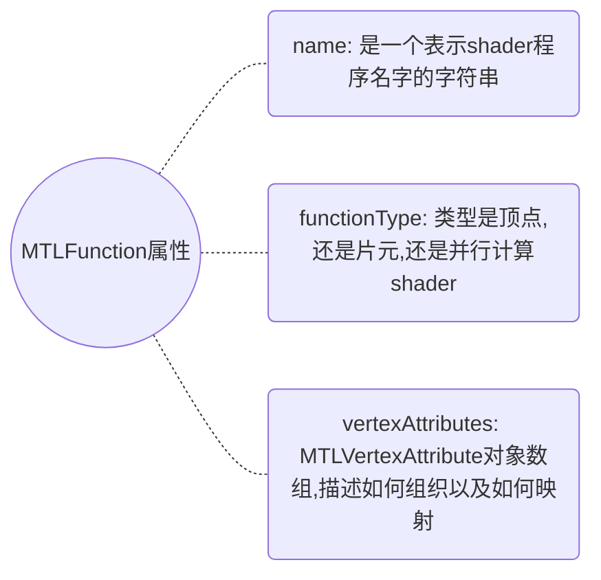
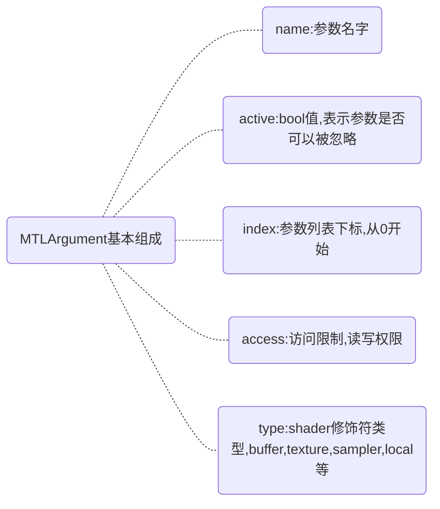

# MetalGuide(3)着色器程序与库

# 1 如何创建Metal库(MTLLibrary)

**Case A. 从已编译的代码中创建Library**  

   为了提升性能，可以利用xcode工具在app的创建过程中就把Metal-Shader源代码编译打包到一个库文件中，如
此避免了在app的运行时编译着色程序代码的开销。从已编译的二进制库中创建一个`MTLLibrary`对象，可以使
用如下的`MTLDevice`方法 ：

- `newDefaultLibrary`  : 会return一个MTLLibrary，包含了渲染shader和app所需的并行计算程序；
- `newLibraryWithFile`:error :  它将返回一个MTLLibrary对象，从指定的库文件路径加载这个库文
  件中的所有shader程序；  
- `newLibraryWithData`:error  :它将返回一一个MTLLibrary对象，从指定的二进制数据块对象加载数据块中的所有shader程序.  

**Case B. 从源代码中创建Library**  

   从包含有Metal-Shader代码编写的多个着色程序的字符串中创建MTLLibrary对象，这些方法将在MTLLibrary对象创建时编译源代码，具体的可以参考如下
MTLDevice方法 ：

- `newLibraryWithSource`:options:error:  属于**同步阻塞调用** ,它编译输入字符串里的源代码创建多个
  MTLFunction对象，最后返回一个包含这些MTLFunction对象的MTLLibrary对象；
- `newLibraryWithSource`:options:completionHandler: 属于**异步调用**，和上一个方法不同的是多了参数代码block块---completionHandler，block将在MTLLibrary对象创建完成后被调用 .

# 2 MTLFunction细节探究  

​     如何从Library中获取Function ，可以用下述方法进行获取：

​     `newFunctionWithName`: 属于MTLLibrary的方法, 返回一个名字为输入参数的MTLFunction对象。如果在library中没有
找到一个方法其修饰名字匹配输入参数，那么该函数返回nil。  

## 2.1 在运行时决定Function的细节 
​     一个MTLFunction对象被定义为图形shader程序或是并行计算程序，它的实质内容在这个对象被创建前
就编译好了，而且shader程序的源代码不能直接被app使用.不过，可以在运行时查询下面的MTLFunction属性：  

## 2.2 相关的Reflection对象

​     `MTLFunction`不提供访问shader程序参数的方法。但在pipeline state创建过程中，可以获得用于展示shader程序参数细节reflection对象(根据command encoder的类型不同， reflection对象分为`MTLRenderPipelineReflection`类型或
`MTLComputePipelineReflection`类型 )。

​      一个reflection对象包含了一个MTLArgument数组，视其关联的Encoder不同而不同：

- MTLRenderPipelineReflection：关联`MTLRenderCommandEncoder` ,包含的Arguments数组有vertexArguments和fragmentArguments 这2个属性；
- MTLComputePipelineReflection ：关联`MTLComputeCommandEncoder` ，包含的Argument数组表征并行计算程序的参数。

​	不是所有的shader程序的参数都在reflection对象中表示，一个reflection对象仅包含那些引用了相应资源的参数，通
过**shader修饰符**[[stage_in]]、 [[vertex_id]]、 [[attribute_id]]修饰的参数不会被包含在reflection对象中。

## 2.3 MTLArgument对象

​	MTLArgument类型对象表示一个shader程序方法的入参细节：  

​    上述的属性type还决定了哪些其他MTLArgument属性是相关的，type类型不同，相关的属性也有所区别：

- `MTLArgumentTypeTexture`   : `textureType`属性表征纹理类型(可能为texture1d_array，
  texture2d_ms， texturecube); `textureDataType`属性表征其分量数据类型(可能为half， float，
  int， uint）; 
- `MTLArgumentTypeThreadgroupMemory`  : 说明threadgroupMemoryAlignment和
  threadgroupMemoryDataSize这两个属性相关；
- `MTLArgumentTypeBuffer`  : 说明bufferAlignment, bufferDataSize, bufferDataType,
  bufferStructType这几个属性相关 。

​	例如：如果bufferDataType的值是MTLDataTypeStruct ，那么bufferStructType属性含有一个MTLStructType类型的值 ,同时bufferDataSize属性表示这个结构体的长度 (bytes数量); 如果缓存Argument是数组，那么bufferDataType属性则表征的是数组元素的类型，同时bufferDataSize属性表示的也只是数组中一个元素的长度。

> 参考链接:
- [Apple-Metal-Programming-Guide](https://developer.apple.com/library/archive/documentation/Miscellaneous/Conceptual/MetalProgrammingGuide/Introduction/Introduction.html)
- [Metal's Best Practice](https://developer.apple.com/library/archive/documentation/3DDrawing/Conceptual/MTLBestPracticesGuide/index.html)

