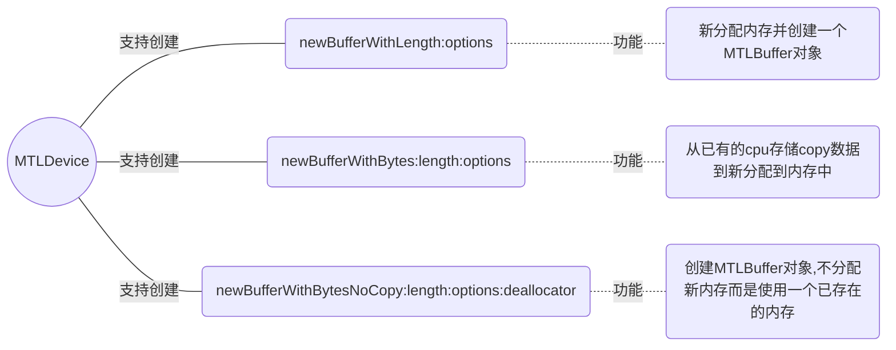
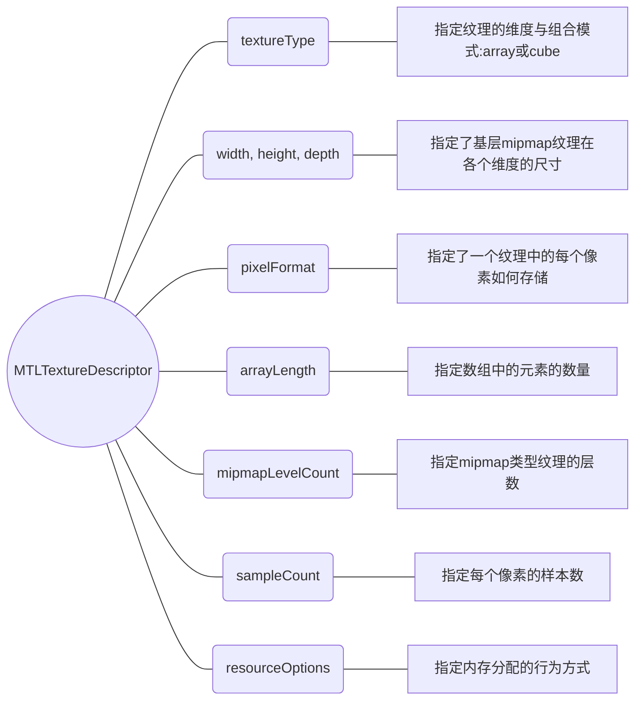
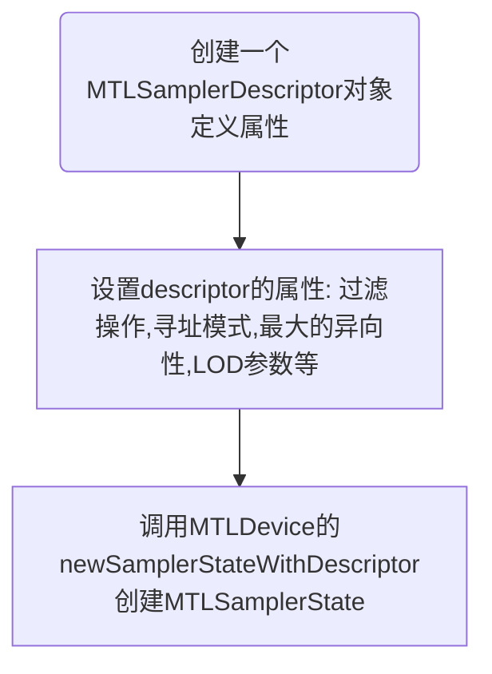

# MetalGuide(2)资源与对象

# 0.资源对象
   资源对象，主要包含为缓存Buffers和纹理Textures。

​	**MTLBuffer**它表示一块非格式化的内存可以存放任何类型的数据。它通常用于存放顶点数据、着色程序和计算状态数据。

​	**MTLTexture**，它表示一块有格式的图像数据，有特定的纹理类型和像素格式。它通常被用作顶点着色程序、片元着色程序、或是并行计算函数的纹理源，它也可以存放图形渲染的结果输出。通常`MTLTexture`结构为这几种：1维、2维、或3维的图像，或是1维、2维的图像数组，或是拥有6个2维图像的立方体。

​	**MTLSamplerState**，虽然采样器不是资源，但它总是用于纹理对象的查找计算。

# 1. 有关Buffer对象

## 1.1 创建Buffer对象

​	一个`MTLBuffer`对象表示了一个可以装载任何类型数据的内存片段。

​	下面的`MTLDevice`方法可以用于创建并返回类型MTLBuffer对象:

## 1.2 Buffer的对象方法

​	Buffer缓存对象有2种方法：

- `contents`: 返回缓存对象对应内存的CPU地址;
- `newTextureWithDescriptor`:offset:bytesPerRow: 创建某种特定类型的纹理。

# 2.Texture对象

## 2.1 创建Texture对象

​	下列的方法用于创建并返回一个`MTLTexture`对象：

- `newTextureWithDescriptor` ：新分配内存并创建一个`MTLTexture`对象，创建时需要传入的MTLTextureDescriptor参数描述了纹理的属性； ⚠️它隶属于**MTLDevice**方法；

  

- `newTextureViewWithPixelFormat` ： 该方法创建出来的 `MTLTexture`新对象和调用源对象共享存储，并重新解释了源纹理对象对应内存的图像格式；调用入参的MTLPixelFormat参数类型必须兼容源纹理对象的图像格式；⚠️它隶属于**MTLTexture**方法;

  

- `newTextureWithDescriptor`:offset:bytesPerRow ：创建一个MTLTexture对 象，共享调用源对象的内存，作为它自己的图像数据；⚠️它隶属于**MTLBuffer**方法。

  

## 2.2 纹理描述符

​	MTLTextureDescriptor(纹理描述符)描述用于创建一个MTLTexture对象的各属性。包括图形尺寸(宽，高，深)，像素格式，组合模式(数组或是立方体)还有mipmaps的数量。

这些属性都只用在MTLTexture对象的创建过程中。当纹理对象创建完毕，descritor中的值后续再改变也不会影响纹理之前由它创建的对象。指定纹理的维度与组合模式(数组或立方)

​	Texture Descriptor内容组成以及含义如下图：

## 2.3 创建纹理描述符

​	对一个2D纹理或是立方纹理来说，下面的快捷方法可以创建`MTLTextureDescriptor`对象并且自动设置多个值：  

- `texture2DDescriptorWithPixelFormat`:width:height:mipmapped: 创建一个描述2D纹理的MTLTextureDescriptor对象，入参width和height定义2D纹理的尺寸， descriptor的type属性自动设置为`MTLTextureType2D`，属性depth和属性arrayLength自动设置为1； 

  

- `textureCubeDescriptorWithPixelFormat`:size:mipmapped:  创建一个描述立方纹理的MTLTextureDescriptor对象, 入参size被设置给width和height， type属性自动设置为`MTLTextureTypeCube`，属性depth和属性arrayLength自动设置为1 。 

  

  上面两个快捷方法都接受一个入参pixelFormat，它定义了纹理的像素格式。这两个方法都接受一个入参mipmapped(值为YES/NO)，它指定纹理是否支持mipmap ；

## 2.4 纹理分片(slice)

​	纹理分片是一个单独纹理数据(可能是1维、 2维或是3维)以及所有和它关联的mipmap。 具有以下特点：

- 其基层的mipmap尺寸由MTLTextureDescriptor对象的width , height , depth属性设定；
- mipmap的第 i 层的尺寸是基层的1/2**i** ;
- **立方cube**(6个2维分片)和**数组array**(每个数组元素对应1个分片)类型的纹理可以有多个分片；一个单独纹理数据(可能是1维、 2维或是3维)只能有1个分片；

## 2.5 Copy图像数据进出纹理对象

​	以**同步**阻塞式拷贝图像数据进出纹理对象的内存，可以使用如下方法：  

* `replaceRegion`:mipmapLevel:slice:withBytes:bytesPerRow:bytesPerImage:  **从**withBytes参数表示的资源对象中**拷贝**指定区域的像素数据**到**一个指定的纹理切片的指定内存区域； 
* `replaceRegion`:mipmapLevel:withBytes:bytesPerRow:  和前一个方法类似，只是slice和bytesPerImage设置为0;  
* `getBytes`:bytesPerRow:bytesPerImage:fromRegion:mipmapLevel:slice:  获取指定切片的指定区域的像素数据  ;
* `getBytes`:bytesPerRow:fromRegion:mipmapLevel:  和前一个方法类似，只是slice和bytesPerImage设置为0;  

## 2.6 纹理MTLTexture像素格式  

​     MTLTexture对象的MTLPixelFormat属性指定颜色、深度或是模板缓存数据中每一个像素如何组织。有3种像素格式：**原生格式**(ordinary),**紧密填充格式**(packed)和**压缩格式(**compressed):  

- **原生格式** ：只有8、16或是32位颜色值，每个分量以升序内存地址排列，第一个分量处于最低的内存地址处 ；例如`MTLPixelFormatRGBA8Unorm`是一个32位格式颜色值 ，RGBA都各自占8bit;

   

- **紧密填充格式** ：把多个颜色分量结合起来从最低位LSB到最高位MSB存放在一个16位或是32位的值中 ；例如 `MTLPixelFormatRGB10A2Uint`是一个32位的填充格式色值,RGB都各自占8bit, A占2bit；

  

- **压缩格式** ：用于排列像素块的，每个块的布局被设定为这种像素格式；只能被用于2D、 2D数组或是立方类型的纹理;

  

- 其他格式：`MTLPixelFormatGBGR422`和`MTLPixelFormatBGRG422`是两种特殊的像素格式，用于存储**YUV颜色**空间的像素数据，只支持不含mipmap且width为偶数的2D类型的纹理。  

  还有几种支持**sRGB**颜色空间的格式，比如`MTLPixelFormatRGBA8Unorm_sRGB`和
  `MTLPixelFormatETC2_RGB8_sRGB` ，**sRGB颜色**空间和**线性颜色**空间可以相互转换。

## 2.7 采样器状态(Sampler States)与纹理

​	`MTLSamplerState`对象(采样器状态)包含了用于*纹理查找* 的属性。 

​    MTLSamplerState定义了寻址、过滤还有其他属性，用于一个图形着⾊色程序或是并行计算着色程序对一个MTLTexture对象实施采样操作。创建一个采样器state对象的步骤如下图：

​    ⚠️注意：descriptor的属性值仅在创建MTLSamplerState对象时生效，state对象创建完成后，改变descriptor的属性值不会影响已经创建的state对象。 

# 3. CPU/GPU内存一致性  

​	CPU和GPU都可以访问同一个`MTLResource`类型的对象管理的存储数据。但是GPU和CPU的操作是异步进行的，为保持一致性，注意该事项：

​	当MTLDevice对象执行一个MTLCommandBuffer对象时，它只有在command buffer被提交之前才能观察到由CPU引起的Command-Buffer内存变化，一旦被提交即状态为MTLCommandBufferStatusCommitted ，MTLDevice对象就观察不到这些资源的变化情况了。

> 参考链接:
- [Apple-Metal-Programming-Guide](https://developer.apple.com/library/archive/documentation/Miscellaneous/Conceptual/MetalProgrammingGuide/Introduction/Introduction.html)
- [Metal's Best Practice](https://developer.apple.com/library/archive/documentation/3DDrawing/Conceptual/MTLBestPracticesGuide/index.html)

