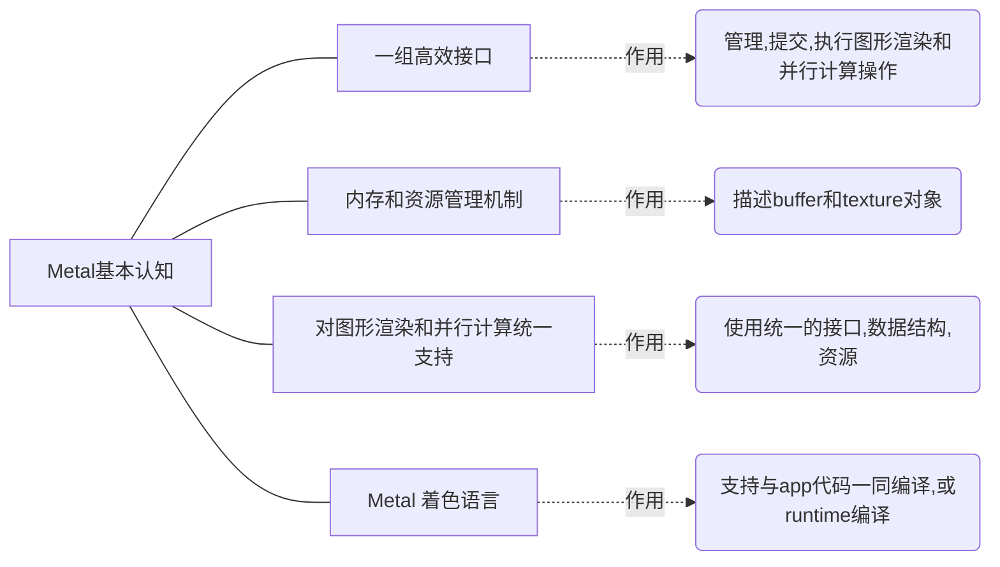
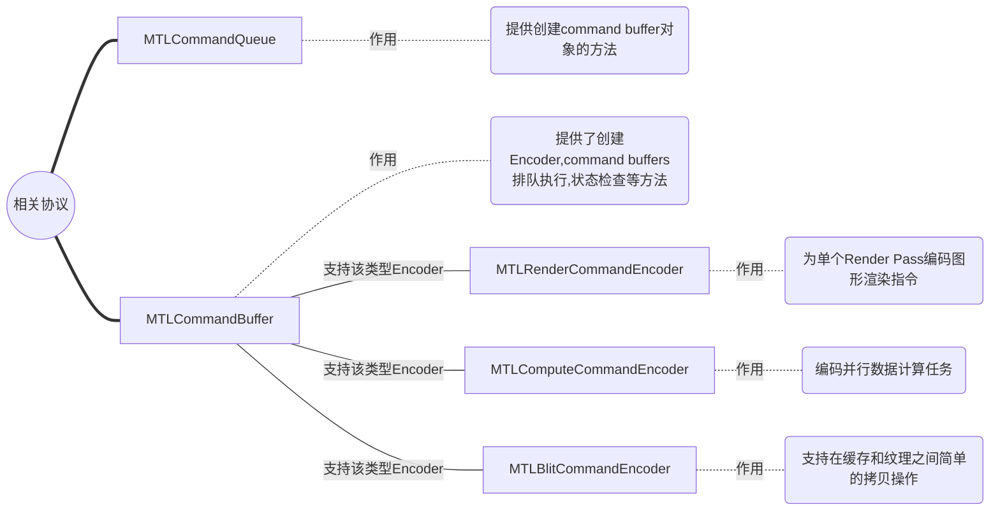
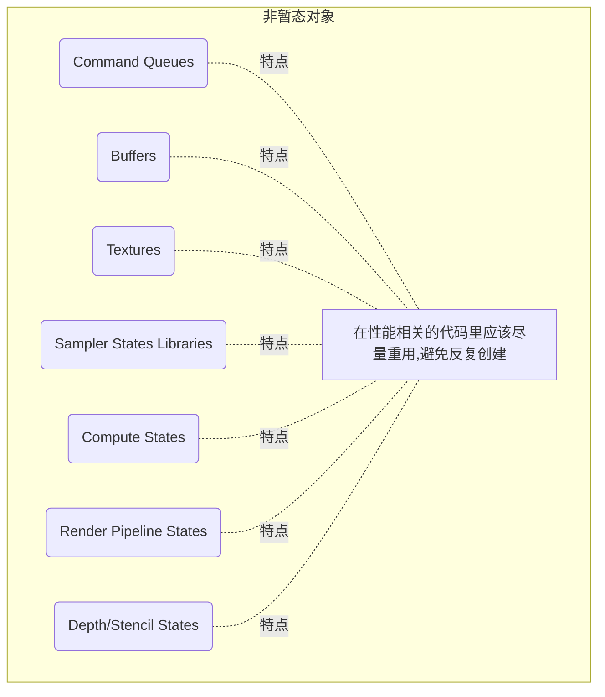
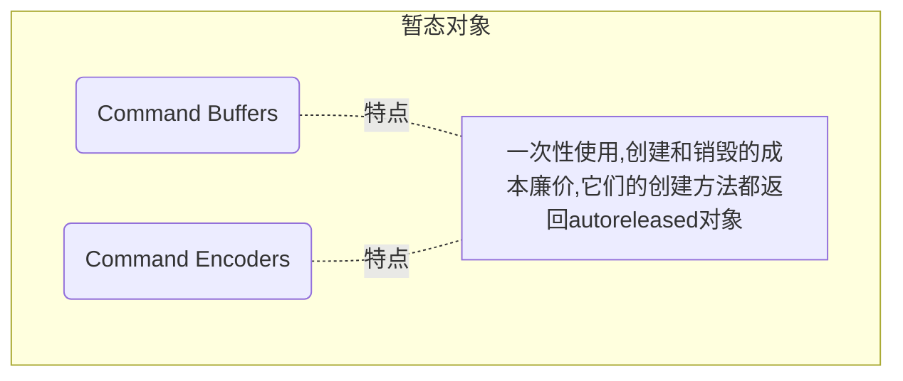

# 1. 基本概念认知

​	`Metal` 是一个和 `OpenGL ES` 类似的面向底层的图形编程接口，通过使用相关的API 可以直接操作 GPU。不过不同的是，`Metal`不具有跨平台特性，只针对苹果的平台系统使用，并且编程开发语言为`Objective - C`或`Swift`。

​	`Metal`框架支持GPU加速的3D图形渲染和并⾏数据计算，它提供了一系列的API用于在**细粒度**和**低层次**上组织、处理、提交图形渲染指令、并⾏计算指令，并管理和这些指令相关联的数据和资源。使用`Metal`的一个主要⽬标是减少GPU执⾏这些计算的开销。

------

# 2. 指令组织和执行模型

​	**一个command queue包含了一系列command buffers**。command queue用于组织它拥有的各个command buffer按序执行。一个command buffers包含多个被编码的指令，这些指令将在一个特定的设备上执⾏。一个Encoder可以将绘制、计算、位图传输指令推入一个command buffer，最后这些command buffer将被提交到设备执⾏。	 

​	任一时刻，只会有一个Encoder是处于激活状态的，它可以向一个command buffer提交指令。前一个Encoder结束后，另一个Encoder才可以被创建并用于同一个command buffer。

​	最终，他们的逻辑模型类似于下图：

## 2.1 何为设备

​	一个**MTLDevice**对象代表一个可以执行指令的GPU，该协议包含创建新的command queue的方法、从内存申请缓存的方法、创建纹理对象的方法以及查询设备功能的方法。调用**MTLCreateSystemDefaultDevice**方法获取系统首选的设备对象。

## 2.2 暂态/非暂态(Non-Transient)对象

​	故名思义，两者是按照对象的**生命周期**来区分的。

在Metal中有些对象被设计成暂态，使用它们⾮常轻量。另外一些则要昂贵许多，因此它们应该拥有长的生命周期。

## 2.3 指令队列(Command Queue)

​	一个command queue管理着一个在GPU上即将执⾏的command buffer有序队列。同一个队列的所有command buffer都会被按照入队的次序执⾏。通常，command queue是线程安全的，允许多个command buffer 同时编码。

​	如何创建Command Queue，以下的2个方法都是可行的:

- `newCommandQueue`

- `newCommandQueueWithMaxCommandBufferCount`

  ⚠️：Command Queue是非暂态对象，是具有长生命周期的，不要反复地创建和销毁这种对象。
  
  

## 2.4 指令缓存(Command Buffer)

### 2.4.1 Command Buffer的特点

​	一个command buffer在被GPU执行之前会存储多个被编码的指令。一个command buffer可以包含多种类型的编码。

​	Command Buffer具有以下特点：
1. 一帧渲染即使含有多个RenderPass或多个计算处理程序、多个位图操作，都可以被编码到同一个Command Buffer中；
2. 它是**暂态对象**，不支持重用；一旦被提交等待执行，即进入队列；
3. 它还代表了app中独立的可被追踪的任务单元。

### 2.4.2 创建Command Buffer

​	如何创建Command Buffer对象，以下的2个方法都是可行的:

- `commandBuffer`：数据是强引用的，一个MTLCommandBuffer对象只能提交给创建它的那个command queue。
- `commandBufferWithUnretainedReferences`：数据不是强引用的，在可以保证和command buffer相关数据在其被执⾏时都有引用计数的情况下，又极端需要提升性能，才会使用该方法。使用时需要格外注意引用计数。

### 2.4.3 执行指令

​	MTLCommandBuffer协议使用如下的方法来设定其在指令队列中的执⾏顺序：

- `enqueue`：为一个command buffer在command queue中预定一个位置，但是不会提交这个command buffer。当这个command buffer最终被提交时，指令队列把它安排在对应的`enqueue`顺序队列中执行。
- `commit`：使得command buffer尽可能快地被执⾏，但还是得等到所有在command queue中的早前排入队列的 其他command buffer被执行完成后才能执⾏。如果commad queue中没有排在前面的command buffer，该方法隐式执⾏`enqueue`操作。

### 2.4.4 注册处理程序块(Register Handler Blocks)

​	下列的MTLCommandBuffer的方法可以**监视指令的执⾏**。使用了这些方法注册处理程序块，那么在某个线程中，这些处理程序块会按照执⾏顺序被调用。这些处理程序块应该是迅速可被执⾏完成的，如果有开销⼤的造成阻塞的任务，那么应该将它们安排到其他线程执⾏行。     		

  - `addScheduledHandler` : 注册的处理程序块将在command buffer被“排定好”(scheduled)时调用。“排定好”一般是指，MTLCommandBuffer对象或系统API提交的所有任务之间的依赖关系都能被满⾜。

  - `waitUntilScheduled` :  调用后就开始等待，return时机为所有command buffer被“排定好”而且`addScheduledHandler`方法注册的处理程序块都执行完毕。

  - `addCompletedHandler` : 注册的处理程序块将在command buffer被执⾏完毕后立即调用；一个command buffer对象可以注册多个这样的处理程序块。

  - `waitUntilCompleted` :  调用后就开始等待，return时机为所有command buffer都执行完而且`addCompletedHandler`注册的处理程序块都执行完毕。

  - `presentDrawable` :  较为便捷，它用于当command buffer处于“排定好”时呈现一个可显示资源 (CAMetalDrawable类型对象)的内容。

    

   执行完毕后，需要关注以下2种Command Buffer的**属性**：

-  **status**: 只读属性，包含了一个`MTLCommandBufferStatus`类型的枚举值，它反映了command buffer在其生命周期中处于哪个阶段。

-  **error**：如果command buffer成功执⾏，值为nil。如果有异常发生，值为“Command Buffer Error Codes”类型。且status属性被设 置为MTLCommandBufferStatusError。

  

## 2.5 指令编码(Command Encoder)

### 2.5.1 Command Encoder的特点

​		Command Encoder用来编码渲染和计算指令，然后被推入到一个command buffer并最终在GPU上执行。它具有以下特点：

- 它有多个`对象方法`可以往Command Buffer里追加指令；
- 当一个Encoder是激活状态时，就可以调用`endEncoding`方法向它所属的command buffer推送指令；
- 推送完成后要写入更多的指令，就创建一个新的 Encoder。

### 2.5.2 创建Command Encoder

​	MTLCommandBuffer协议中的若干方法都可以创建Command Encoder对象，这些对象可以向对应的command buffer推送指令。具体地，以下的4个方法都是可行的:

   - `renderCommandEncoderWithDescriptor` ：创建一个MTLRenderCommandEncoder类型的Encoder实现图形渲染，图形绘制用到的attachment附件由那个MTLRenderPassDescriptor类型的入参对象指定；

     

   - `computeCommandEncoder` ：创建一个MTLComputeCommandEncoder类型的Encoder来实现并行数据计算；

     

   - `blitCommandEncoder` ：创建一个MTLBlitCommandEncoder类型的Encoder来实现内存操作；

     

   - `parallelRenderCommandEncoderWithDescriptor` ：创建一个MTLParallelRenderCommandEncoder类型的Encoder，它用于支持多个MTLRenderCommandEncoder类型的⼦Encoder同时在**不同的线程**中运⾏，依然把所有绘制结果写入同一个attachment中，该attachment由MTLRenderPassDescriptor类型的入参指定。

### 2.5.3 多种用途的Command Encoder

​		**<u>*a. 用于渲染的Command Encoder*</u>**

​			图形渲染可以被描述为一系列的Render Pass，一个`MTLRenderCommandEncoder`对象表示和一个Render Pass相关联的渲染状态和渲染命令。这个Encoder对象需要一个相关联的MTLRenderPassDescriptor对象，在这个descriptor对象中包含颜⾊、深度、模板等依赖信息。

​			`MTLRenderCommandEncoder`拥有各类方法可以完成以下事项：

​			设定图形资源，比如缓存和纹理对象，这些对象包含着顶点⽚元和纹理数据；

​			设定固定图形渲染管线状态，包括视口，三角形填充模式，裁剪矩形，深度测试和模板测试等等。			

​		<u>***b. 用于并行计算的Command Encoder***</u>

​			使用`MTLCommandBuffer`的`computeCommandEncoder`方法可以创建一个并行计算用的Command Encoder。

​			对于并⾏数据计算，`MTLComputeCommandEncoder`协议提供了方法来编码计算指令，以此设定计算程序和参数，调度计算程序执⾏。

​		**<u>*c. 用于位图操作的Command Encoder*</u>**

​			使用`MTLCommandBuffer`协议的`blitCommandEncoder`方法可以创建一个`MTLBlitCommandEncoder`。

​			`MTLBlitCommandEncoder`协议提供了方法用来在缓存(MTLBuffer) 和纹理(MTLTexture)之间进⾏拷贝。

​			该协议还提供了用一种颜⾊填充纹理的方法，以及创建mipmap的方法。	

​				

## 2.6 多线程与Command Buffer/Command Encoder

​	很多的应用程序只是用**一个线程**来编码绘制指令到一个command buffer来绘制一帧画面。在每帧绘制的末尾， 提交commad buffer，如此可以排定和开始指令的执行。

​	如果希望并行地让command buffer执⾏指令编码，那么可以同时创建多个command buffer，使用多个线程，每个线程单独为一个command buffer编码指令。

​	如果事先知道command buffer应该以什么顺序执⾏，那么 MTLCommandBuffer的enqueue方法可以在command queue中声明执⾏行顺序，⽽不必等待执⾏编码和提交操作。否则只能等到command buffer被提交，这时在command queue中它就被指定了一个位置，顺序位于之前提交的 command buffer后面。

​	任一时刻只有一个GPU线程在访问command buffer，多线程的应用可以为每个command buffer准备一个线程，如此实现并⾏创建多个command buffer。

​	下图示例了一个3线程应用，每个线程都操作一个command buffer，每个线程中，任一时刻只有一个Encoder在访问它对应的command buffer。当你完成了编码，调用Encoder的`endEncoding`方法，然后一个新的Encoder才可以为command buffer编码指令。

> 参考链接:
- [Apple-Metal-Programming-Guide](https://developer.apple.com/library/archive/documentation/Miscellaneous/Conceptual/MetalProgrammingGuide/Introduction/Introduction.html)
- [Metal's Best Practice](https://developer.apple.com/library/archive/documentation/3DDrawing/Conceptual/MTLBestPracticesGuide/index.html)

